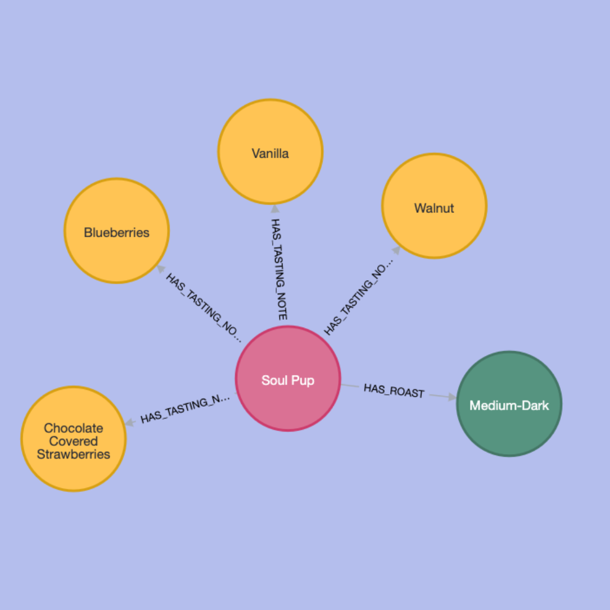

# caffeinatedgraph
Coffee Knowledge Graph to choose next coffee blend to try

## Overview
As a huge fan of Grounds & Hounds Coffee Co., I wanted a unique way to explore their coffee blends and decide on my next cup. This project uses a **knowledge graph** to represent various coffee blends, their tasting notes, roast levels, and similarities, helping coffee lovers like myself discover new blends based on their preferences.

Built with **Neo4j** for graph database support and **LangChain** for intelligent querying, this project leverages vector similarity and structured queries to make personalized recommendations.

## Coffee Blend Graph Model

This is the graph model showing the relationships between coffee blends, roast types, and tasting notes.

## Features
- **Coffee Blend Recommendations**: Uses vector similarity indexing to recommend coffee blends similar to ones you’ve tried before.
- **Tasting Notes and Roast Type Queries**: Natural language queries let you search for blends by specific tasting notes (like chocolate, vanilla) or roast types (light, medium, dark).
- **Seamless Integration with Neo4j and LangChain**: Combines the power of Neo4j’s vector indexing and LangChain’s Cypher QA Chain to process both similarity-based and attribute-specific queries.

## How It Works
1. **Vector Similarity**: Each blend description is embedded as a vector and indexed in Neo4j. When you ask for similar blends, the vector index returns coffee blends that share close flavor profiles.
2. **Cypher QA Chain for Attribute Searches**: If you're interested in specific tasting notes or roast levels, LangChain’s Cypher QA Chain interprets the query and uses Cypher to fetch relevant blends.

## Technologies Used
- **Neo4j**: A graph database for storing and querying coffee blends, tasting notes, and roast types.
- **LangChain**: Handles natural language queries with GraphCypherQAChain, allowing both structured and unstructured questions.
- **OpenAI Embeddings**: Provides vector embeddings for descriptions, enabling the similarity-based recommendation system.

## Example Queries
1. **Recommend similar blends**: "Recommend some coffee blends I might like based on Alpha Blend Dark Roast."
2. **Find blends by tasting note**: "What coffee blends have vanilla notes?"
3. **Search by roast type**: "Show me all coffee blends that are light roast."

## License
This project is part of my portfolio and is intended solely for demonstration purposes. 

### Important Notes

- **Credentials**: All credentials have been omitted for security purposes.
- **Data**: The repository does not include any scraped or proprietary data from Grounds & Hounds Coffee Co., out of respect for their brand and intellectual property.

